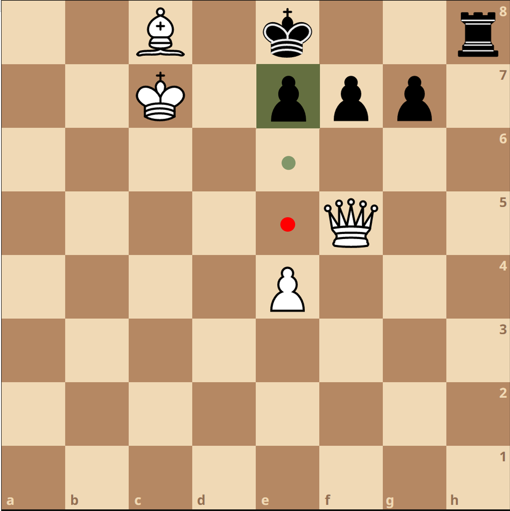

# The Beautiful Chess

In this part of the project, we will make the chess game we created earlier graphical. For this purpose, the **SFML library** has been used, and its tutorial, along with a complete example (designing a Tic Tac Toe game), has been recorded and provided in the link above.

The visualization of the chess game is entirely up to you. Try to be creative and design the chessboard in an aesthetically pleasing way. You can use any images or color combinations for the pieces or the board. The **UI** design is also your responsibility, including how it should look and how the messages displayed on the screen appear and in which frame.

Regardless of your choice of chess design, your game must include the following features:

-   **Selection Capability**: When the user clicks on a piece, that piece should be selected (implement the selection in a way that fits your graphical theme). Then, all the piece's valid moves should be displayed on the board. For example, the lichess.org website has implemented this feature in the following manner:

**Checkmate Display Feature**: When the king is put in checkmate by the opposing player, this should be visually indicated in some way. You can use methods such as changing the background color to red, altering the color of the piece, or any other approach you see fit. For example:

-   **Test Case Input Capability**: Similar to the inputs from Phase 1, there should be a feature allowing a specific chessboard state to be input and displayed on the game board accordingly. While implementing this in the console is acceptable, including it in the graphical interface will earn bonus points. Another convenient method is inputting data through the system clipboard, as explained in the tutorials.
    
-   **Reset Capability**: Add a **Reset** button to the graphical interface, which resets the chessboard to its initial state when pressed.
    
-   **Advanced Selection Capability**: Enhance your selection feature by adding functionality to highlight "critical moves." When a piece is selected and its valid moves are displayed, any move that leads to a disadvantage (e.g., an imminent checkmate in the next few turns) should be visually marked with a distinct color.  
    For instance, in the first test case of Phase 1, the pawn moving to **e6** was valid, but moving to **e5** would have resulted in checkmate within two turns by the opponent. Highlight such moves distinctly (e.g., using a red circle as shown in the example below) to inform the player not to make those moves:

    -   **Mate Highlighting**: You can use a blue circle (or any design of your choice) to indicate moves that would result in checkmate if performed. This will help players recognize winning moves.
    
-   **Turn Indicator**: Your chess game should clearly display whose turn it is (e.g., white or black).
    
-   **Winner Announcement**: At the end of the game, the program should declare the winner. Ensure this is displayed prominently in the graphical interface.

